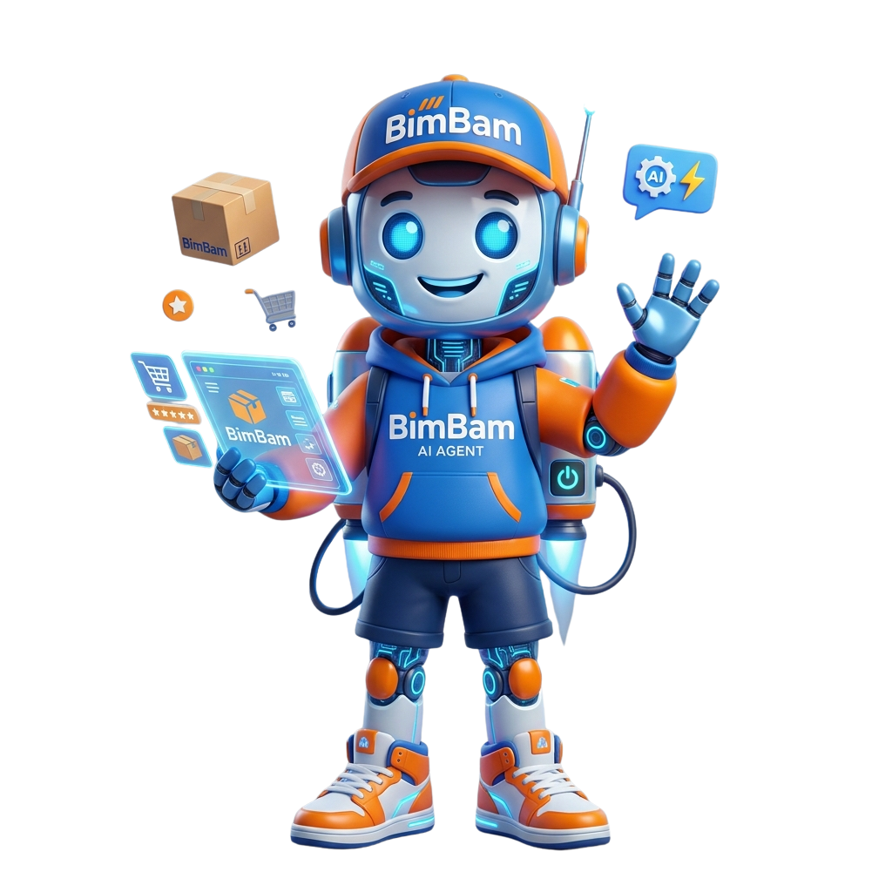

# 🤖 BimBam Boy — Agente de IA con RAG

Asistente virtual inteligente para **BimBam Buy**, una tienda de e-commerce ficticia. BimBam Boy responde preguntas de clientes utilizando exclusivamente la información contenida en los documentos internos de la empresa (envíos, pagos, reembolsos, devoluciones y programa de afiliados), evitando alucinaciones y manteniendo siempre respuestas basadas en fuentes verificables.

Este proyecto fue desarrollado como parte del reto de la especialización **Oracle Next Education / Alura LATAM**, cuyo objetivo es construir un agente de IA con Python, LangChain, LangGraph y RAG (Retrieval-Augmented Generation).



---

## ✨ Características

- 💬 **Chat conversacional** con memoria de contexto (recuerda las últimas interacciones de la conversación).
- 📚 **RAG (Retrieval-Augmented Generation)**: las respuestas se generan únicamente a partir de los documentos cargados, nunca de conocimiento externo del modelo.
- 🧭 **Enrutamiento inteligente**: un clasificador decide si la pregunta debe resolverse con documentos (`rag`), como conversación básica (`direct`, saludos/despedidas) o como aviso de fuera de tema (`off_topic`, preguntas ajenas al negocio).
- 📤 **Gestión de documentos en vivo**: subir y eliminar archivos PDF/TXT desde la interfaz, sin necesidad de reiniciar la aplicación.
- 🔍 **Fuentes citadas**: cada respuesta basada en documentos muestra qué archivo y página se consultaron.
- 🛡️ **Manejo de errores robusto**: fallos del proveedor del LLM (rate limits, problemas de conexión, autenticación) se comunican con mensajes claros, sin exponer detalles técnicos internos.
- 🎨 **Interfaz personalizada** con la identidad visual de BimBam Boy.

---

## 🏗️ Arquitectura

El agente está construido como un grafo de estados con **LangGraph**, donde cada nodo representa un paso del razonamiento. Un clasificador (`analyze_question`) decide primero por cuál de tres caminos sigue la pregunta:

1. **`rag`** — la pregunta parece relacionada con BimBam Buy:
   `retrieve_documents` → `build_context` → `validate_context` → `generate_answer` → `extract_sources`
2. **`direct`** — es un saludo, despedida o agradecimiento:
   `generate_direct_answer` (responde sin consultar documentos)
3. **`off_topic`** — la pregunta es claramente ajena al negocio (ej. cultura general):
   `generate_off_topic_answer` (mensaje fijo, sin gastar consultas al LLM ni a la base vectorial)

Si en el camino `rag` no se encuentra información suficiente en los documentos, el agente responde honestamente que no tiene esa información, en vez de inventar una respuesta.

**Flujo de ingesta de documentos** (independiente del chat):

`Subida de archivo` → `DocumentLoader` → `TextSplitter` → `EmbeddingModel` → `ChromaDB`

---

## 🛠️ Stack tecnológico

| Componente | Tecnología |
|---|---|
| Orquestación del agente | [LangGraph](https://github.com/langchain-ai/langgraph) |
| Framework de LLM | [LangChain](https://www.langchain.com/) |
| Modelo de lenguaje | [Groq](https://groq.com/) (`llama-3.3-70b-versatile`) |
| Embeddings | HuggingFace `sentence-transformers/paraphrase-multilingual-mpnet-base-v2` |
| Base vectorial | [ChromaDB](https://www.trychroma.com/) (métrica coseno) |
| Interfaz | [Streamlit](https://streamlit.io/) |
| Testing | [pytest](https://docs.pytest.org/) |

---

## 📁 Estructura del proyecto

```
knowledge-agent
├─ .streamlit
│  └─ config.toml          # Tema visual de Streamlit
├─ app.py                  # Punto de entrada de la aplicación
├─ assets
│  └─ img
│     └─ bimbam_boy.png    # Mascota / identidad visual
├─ config.py               # Configuración centralizada (variables de entorno)
├─ conftest.py             # Fixtures compartidas de pytest
├─ data
│  ├─ documents             # Documentos indexados (fuente de verdad del RAG)
│  └─ uploads                # Buffer temporal de subidas (se limpia automáticamente)
├─ reindex.py               # Script para reconstruir la base vectorial desde cero
├─ requirements.txt
├─ src
│  ├─ exceptions            # Excepciones personalizadas del dominio
│  ├─ graph                 # Definición del grafo del agente (LangGraph)
│  │  ├─ graph.py
│  │  ├─ nodes.py
│  │  └─ state.py
│  ├─ llm
│  │  └─ llm.py             # Configuración del cliente del LLM (Groq)
│  ├─ memory
│  │  └─ conversation.py    # Manejo del historial de conversación
│  ├─ models                # Modelos de datos (Pydantic/dataclasses)
│  ├─ prompts               # Prompts del sistema y del router
│  ├─ rag                   # Pipeline de RAG
│  │  ├─ embeddings.py
│  │  ├─ loader.py
│  │  ├─ retriever.py
│  │  ├─ splitter.py
│  │  └─ vector_store.py
│  ├─ services              # Capa de servicios (subida, borrado, orquestación del chat)
│  ├─ ui                    # Componentes de interfaz (Streamlit)
│  │  ├─ chat.py
│  │  ├─ sidebar.py
│  │  └─ styles.py
│  └─ utils
└─ test_agent_service.py    # Tests end-to-end del agente
```

---

## 🚀 Instalación

### 1. Clonar el repositorio
```bash
git clone <url-del-repositorio>
cd knowledge-agent
```

### 2. Crear y activar un entorno virtual
```bash
python -m venv .venv

# Windows
.venv\Scripts\activate

# Linux/Mac
source .venv/bin/activate
```

### 3. Instalar dependencias
```bash
pip install -r requirements.txt
```

### 4. Configurar variables de entorno
Crea un archivo `.env` en la raíz del proyecto con el siguiente contenido:

```env
# Groq
GROQ_API_KEY=tu_api_key_de_groq

# Modelo
MODEL_NAME=llama-3.3-70b-versatile
TEMPERATURE=0

# RAG
TOP_K=3
SCORE_THRESHOLD=0.8
CHUNK_SIZE=1000
CHUNK_OVERLAP=200

# Embeddings
EMBEDDING_MODEL=sentence-transformers/paraphrase-multilingual-mpnet-base-v2

# ChromaDB
CHROMA_PATH=data/chroma_db
COLLECTION_NAME=knowledge_store

# Documentos
DOCUMENTS_PATH=data/documents
```

> Obtén tu API key gratuita en [console.groq.com](https://console.groq.com/keys). **Nunca subas tu `.env` a un repositorio público** — asegúrate de que esté incluido en `.gitignore`.

### 5. Indexar los documentos iniciales
```bash
python reindex.py
```
Este paso carga, trocea y guarda en ChromaDB todos los documentos disponibles en `data/documents/`.

---

## ▶️ Uso

Levanta la aplicación con:
```bash
streamlit run app.py
```

Se abrirá en tu navegador (por defecto en `http://localhost:8501`). Desde ahí puedes:
- Escribir preguntas sobre BimBam Buy en el chat.
- Subir nuevos documentos (PDF o TXT) desde la barra lateral.
- Eliminar documentos existentes con el botón 🗑️ junto a cada uno.
- Limpiar el historial de la conversación con el botón correspondiente.

---

## 🔄 Reindexación

Si necesitas reconstruir la base vectorial por completo (por ejemplo, después de cambiar el modelo de embeddings o la métrica de similitud), corre:

```bash
python reindex.py
```

Esto borra la colección actual de ChromaDB y vuelve a indexar todos los documentos de `data/documents/` desde cero.

---

## 🧪 Tests

El proyecto incluye una suite de pruebas automatizadas con `pytest` que valida el comportamiento end-to-end del agente: respuestas basadas en documentos, manejo de preguntas fuera de dominio y saludos.

```bash
pytest
```

---

## 🎨 Identidad visual

La interfaz utiliza una paleta de colores inspirada en la mascota **BimBam Boy**: azul royal y naranja como colores principales, sobre un fondo oscuro que resalta el contenido del chat.